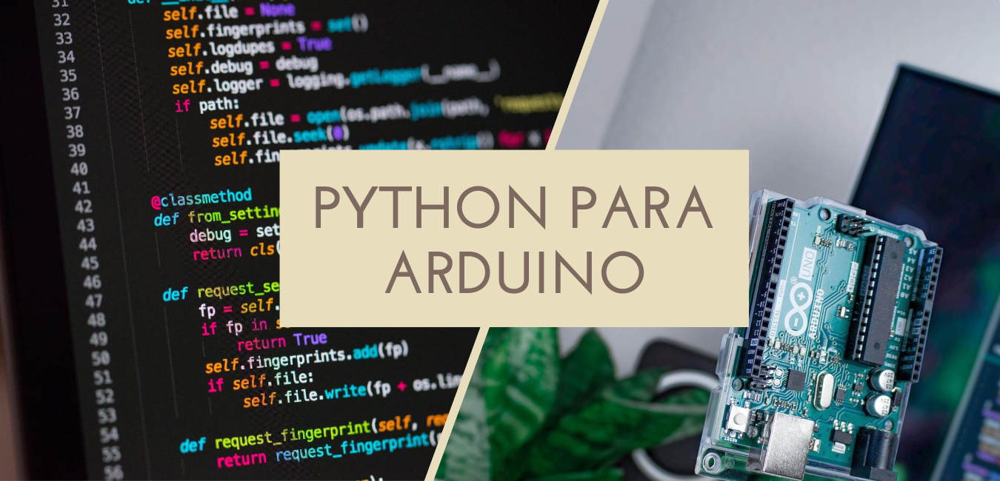

# Python para Arduino ou Arduino para Python?

A ideia da apresentação é mostrar como é possível integrar Arduino e Python e o que dá pra fazer com isso! Com a diversidade de trabalhos que podem ser feitos com Arduino e a facilidade da linguagem de programação python, é possível desenvolver uma infinidade de projetos e protótipos com inúmeras funcionalidades interessantes. O objetivo é que com isso, seu leque de possibilidades aumente e seja acionado um gatilho, que dirá que muitas coisas que parecem complexas são possíveis e mais fáceis do que parece.

# Sumário
1. [Whoami](#whoami) 
1. [Introdução](#introd)
    - [Expectativas](#expectativa)
    - [Expectativas](#realidade)
    - [Porquê python?](#porque-python)
        - [Facilidades do Python](#facilidade-python1)
2. [Objetivo](#objetivo)
3. [O que preciso saber sobre Arduino para conectar no Python?](#sobre-arduino)
4. [O que preciso saber sobre Python para conectar no Arduino?](#sobre-python)
5. [Códigos, Aplicações e Utilitários](#aplicacao)
6. [Contato](#contato)

<a href="https://www.instagram.com/matteus_antonio/">
    
</a>

<p>
    Minha jornada se iniciou depois que entrei na Universidade, no curso de Engenharia da Computação. Já tinha um background técnico, com um pouco de prática em robótica e programação, porém nada extraordinário e diferente do que se encontra nos tutoriais básicos da web. Com uma ideia de que iria trabalhar bastante com robótica, programação, participar de competições e desenvolver projetos, cheguei muito empolgado e com vontade de aprender. O problema é que não existiam grupos de estudo, laboratórios abertos para ensinar e muitas pessoas interessadas em ensinar. Além disso, as disciplinas exigiam esse conhecimento, para criação de projetos e pôr em prática diversos conteúdos do curso que estão envolvidos com essas práticas.
</p>

<p>
    Por isso depois que surgiu uma oportunidade de iniciar um Grupo de estudos em Robótica junto ao IEEE, entrei para o time junto com alguns amigos e passamos a ser os responsáveis por criar essa cultura ali dentro. Os anos se passaram e hoje temos diversas pessoas trabalhando no projeto juntos, como uma comunidade, que colabora com todos espalhando conhecimento e aprendendo muito no processo.
</p>

<p>
    Além desse projeto, também sou responsável por uma loja de componentes eletrônicos, o <!--a href="becodaeletronica.com">Beco da Eletrônica</a--> Beco da Eletrônica, que funciona localmente no Centro de Informática da UFPB, oferecendo materiais para que todos tenham acesso e possam realizar diversos projetos. 
</p>

> ## Contato
> - Email: mateusasilva3@gmail.com
> - Instagram: <a href="instagram.com/matteus_antonio">@matteus_antonio</a>

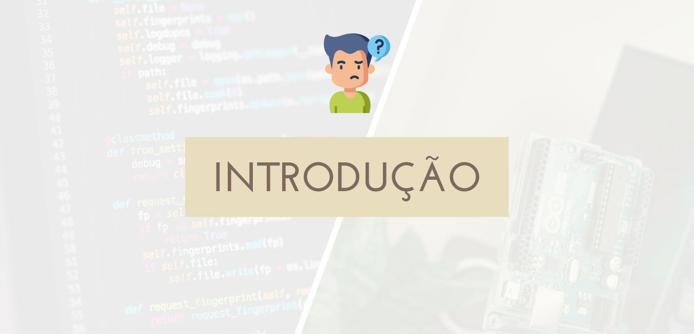

<p>
    Esse documento é baseado em uma palestra que foi realizada pela primeira vez no evento online <b>RAS WEEK</b>, com foco em temas de robótica, saúde e tecnologia no geral. Nele serão apresentados duas tecnologias bastante utilizadas no ambiente educacional: Arduino e Python. O Arduino é uma plataforma de criação de protótipos bastante conhecida, utilizada com sensores e atuadores para realizar projetos com potencial para virarem produto no mercado. Comumente utilizado para validação de ideias, é aplicado em projetos de pesquisa, extensão, pesquisas e principalmente para ensino de robótica e automação nas escolas e universidades.
</p>

<p>
    Já o python é uma linguagem de programação considerada ideal para interessados por programação, em qualquer área de atuação ou idade, pois é simples e versátil. Não é necessário muito tempo para aprender o básico e possui diversas bibliotecas que fazem bastante trabalho por você, por isso se torna uma ferramenta poderosa e mostraremos como isso pode ser utilizado a nosso favor para a criação dos projetos com Arduino.
</p>

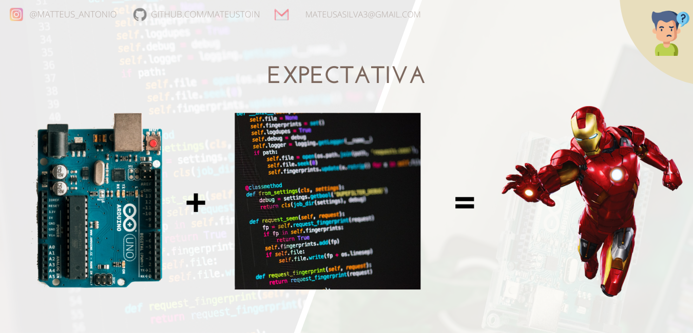
<p>
    Muitos imaginam que já vão começar aprendendo desenvolvimento avançado, realizar funções complexas e desenvolver sistemas robustos, como um Jarvis da vida. Pra chegar nesse nível precisamos entender diversas coisas, o início do conhecimento, para que seja construída uma base sólida e só depois construir aplicações cada vez mais legais e cheias de funcionalidades.
</p> 

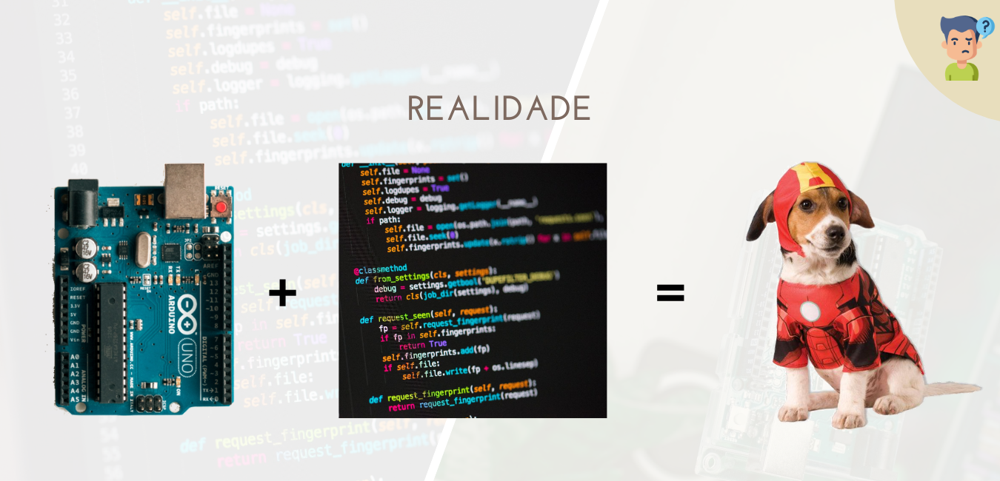

<p>
    Sem querer criar muitas expectativas, essa apresentação não vai preparar ninguém pra fazer o próximo homem de ferro. A abordagem aqui será um pouco superficial, mas será o suficiente pra despertar muita curiosidade. Veremos algumas implementações e aplicações que podem ser um ponta pé inicial para esse projeto (Jarvis)!
</p>

## Porquê Python? <a id="porque-python"></a>


<p>
    A facilidade para se aprender python é um fator muito importante para a escolha da linguagem, mas acima de tudo, a acessibilidade de informações e quantidade de materiais é indispensável. Hoje é possível encontrar ótimos cursos de python, do básico ao avançado, em algumas plataformas como o <i>Coursera</i>, <i>Youtube</i>, <i>Udemy</i>, entre muitos outros.
</p>

<p>
    Na figura acima podemos observar o curso de Python do renomado Gustavo Guanabara, que foi criado com o objetivo de iniciar as pessoas na programação a partir do 0. Além disso temos algumas opções na plataforma da Udemy, que se filtrar por cursos de python grátis, gera mais de 100 resultados. Ou seja, opções não faltam, basta procurar e começar!
</p>


<p>
    Para mostrar um exemplo prático, o código em python exibido acima é responsável por controlar um Drone! Alguns drones no mercado funcionam com aplicativos de celular ou controles mais simples, pois são de baixo custo e feito para iniciantes. Em alguns casos, como o dro drone mostrado (DJI Tello), a empresa disponibiliza um <i>SDK</i> (Software Development Kit, do inglês Kit de Desenvolvimento de Software). Com esse SDK podemos utilizar uma linguagem de programação para desenvolver o nosso próprio sistema de controle do dispositivo, nesse caso, o drone. 
</p>

```python
1: from djitellopy import Tello
```
<p>
    Na primeira linha do código podemos observar a importação da biblioteca Tello, responsável por controlar o drone. Nela contém o SDK, mencionado anteriormente, que possui tudo que é necessário para acionar as funcionalidades do quadricoptero.
</p>

```python
2: tello = Tello()
```
<p>
    Na segunda linha do código criamos uma variável que "armazenará" todas as funções que utilizaremos. Isso é comum e ocorre com a maioria das bibliotecas que utilizamos para fazer coisas no python. Com isso o <i>tello</i> ficará responsável por chamar o que chamamos de métodos (funções dentro da biblioteca que adiconamos).
</p>

```python
3: tello.connect()
```
<p>
    Na linha 3 o primeiro método é chamado, para conectar o computador que está executando o código ao drone. Depois que a conexão é estabelecida, já é possível enviar comandos, pois o drone irá "escutar".
</p>

```python
4: tello.takeoff()
```
<p>
    Depois de conectado, o primeiro comando é enviado, para levantar voo.
</p>

```python
5: tello.move_left(100)
```
<p>
    Depois de ter o voo levantado, agora o drone é movido 100 centímetros para a esquerda.
</p>

```python
6: tello.rotate_counter_clockwise(45)
```
<p>
    Depois de mover os 100 centímetros, ele gira no sentido anti-horário 45°.
</p>

```python
7: tello.land()
```
<p>
    Depois de ter finalizado o giro, pousa no chão.
</p>

```python
8: tello.end()
```
<p>
    Depois de ter pousado, encerra a conexão do programa com o drone.
</p>

<p>
    Os códigos foram exibidos e explicados para mostrar como é simples a cadeia de comandos que você pode fazer no python para realizar uma tarefa. Se com drones é possível ter um controle tão simples, quem dirá funcionalidades que podemos implementar no python, como reconhecimento de voz, entre outros. Como dito anteriormente, algumas coisas são mais simples do que parece e é isso que iremos explorar!
</p>

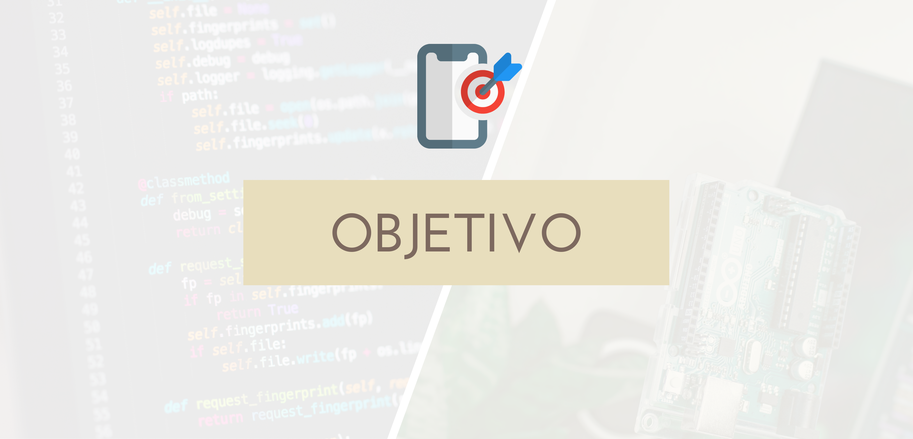

<p>
    Como mencionado anteriormente, o objetivo é que com os códigos que serão mostrados e o exemplos fornecidos, <b>você seja capaz de desenvolver muito mais projetos</b> a partir dali, com diversas funcionalidades. 
</p>

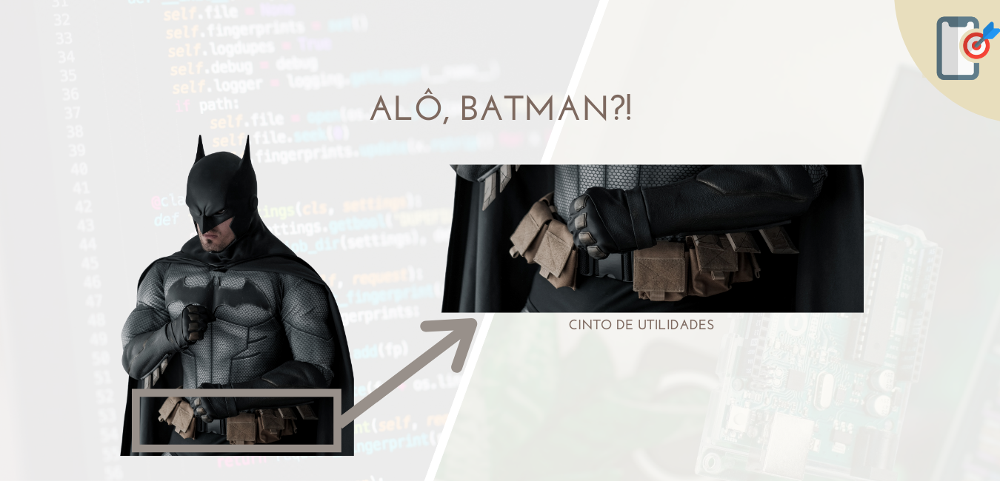

Com isso, <b>seu leque de opções</b> vira o verdadeiro cinto do Batman, com diversas ferramentas para resolver os problemas mais variados! Ter conhecimento acerca dessas tecnologias significa que para cada problema que surgir, mais soluções poderão ser pensadas para resolvê-lo. Além disso, a própria prática com essas tecnologias auxilia no aprendizado delas individualmente, como <b>melhorar programando</b>, <b>utilizando algoritmos</b>, <b>estruturas de dados</b> e <b>ferramentas do mercado</b>, como criando protótipos para projetos cada vez mais complexos e aprendendo sobre eletrônica e hardware no processo.

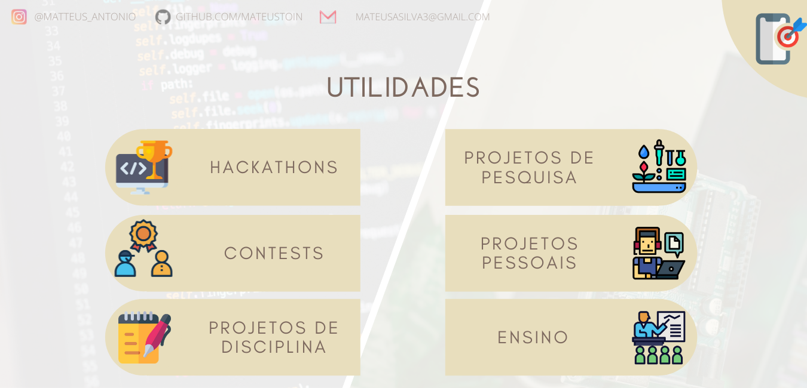

<p>
    No final das contas, depois que passar por todo esse processo, todo esse conhecimento será útil para diversas coisas! <b>Hackathons</b> acontecem em todo o País o tempo todo, em eventos e plataformas online, com diversos problemas esperando as soluções mais criativas. <b>Contests</b> também ocorrem com frequências, mais focado em desafios para não só resolução de problemas, mas também criação de coisas dentro de regras que podem variar bastante de acordo com o tema. Ambos tem premiações que podem chegar a ser bem legais. 
</p>

<p>
    <b>Projetos de disciplinas</b> e <b>projetos de pesquisa</b> estão estritamente ligados ao meio acadêmico, dependendo do laboratório, disciplina ou professor responsável em que você está envolvido. Na universidade e em diversas instituições de ensino sempre se está trabalhando em soluções científicas e resolução de problemas para uma contribuição maior. Portato, ter um conhecimento para a resolução de problemas no geral trazem diversas vantagens em uma seleção para bolsa de pesquisa, mais prestígio na criação de <b>projetos para disciplinas</b> que exijam conhecimento na área, entre outras situações.
</p>

<p>
    Com <b>projetos pessoais</b> não é muito diferente, mas o mais legal é poder criar, modificar e ser o mais versátil possível, tendo a própria criatividade como o único limite imposto. A quantidade de aprendizado acerca de diversos temas é inifinito, pois cada coisa aprendida leva a uma combinação de projetos e ideias que seria impossível realizar todos. Isso desperta não só um crescimento pessoal mas também pode levar a outros campos, como o Ensino, <b>quando há uma vontade e paixão por aquilo</b>, não só de desenvolver, mas de fazer com que outras pessoas também enxerguem esse potencial.
</p>

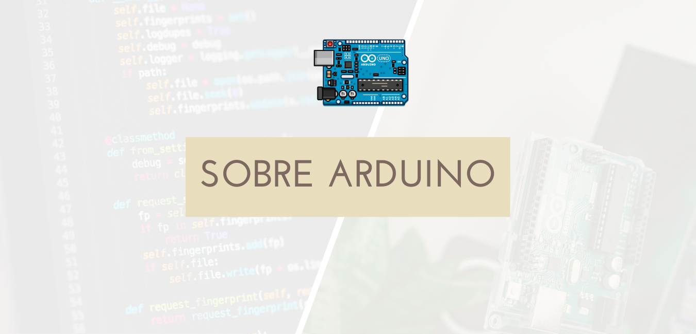

<p>
    Nesta seção será mostrada os principais pontos relacionados ao Arduino que precisamos saber para realizar a comunicação entre ele e a linguagem de programação Python. Além disso, <b>o que daria pra fazer com essa integração?</b> Porque seria tão útil aprendê-la, além dos pontos que já foram levantados? Veremos uma visão mais técnica da coisa.
</p>

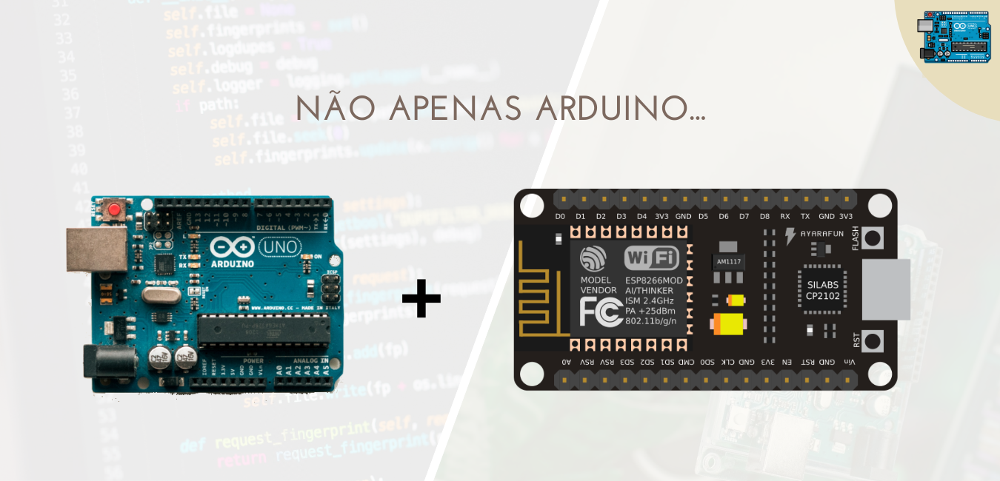

<p>
    É válido dizer que as dicas e informações passadas aqui não valem apenas para Arduino, mas também com ESP8266 e outros tipos de placas de desenvolvimento. Como vai ser mostrado a frente, <b>essas placas tem algo em comum: a forma em que se comunicam com o computador</b>.
</p>

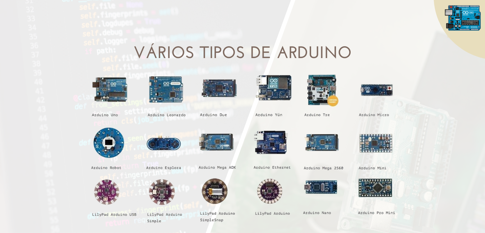

<p>
    Então dá pra desfrutar de diversas funcionalidades através dos diversos tipos de placas. O <b>Arduino tem inúmeras versões</b>, cada uma com sua particularidade, e é possível desfrutar de cada uma dessas particularidades para a criação dos projetos com Python.
</p>

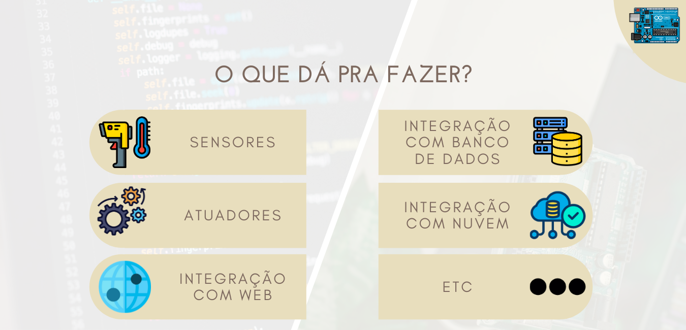

<p>
    Mas afinal de contas, o que dá pra fazer com isso que vamos aprender? Só dizer que a quantidade de possibilidades é vasta não adianta, é preciso falar quais são. Como já é conhecido, um dos maiores motivos do Arduino ser a placa de desenvolvimento mais famosa é a quantidade de <b>sensores e atuadores</b> que podem ser utilizados com ele, a fim de coletar dados e realizar funções. Se o Arduino por si só já consegue realizar inúmeras tarefas com seus próprios sensores e atuadoras, imagine com a utilização de funções do Python, conexão com a internet, uso de bibliotecas próprias do python para auxiliar nas tomadas de decisão. Com a facilidade das <b>bibliotecas</b> do Python e comunicação com o Arduino, seria possível desfrutar da internet, armazenar os dados do Arduino em diversos tipos de banco de dados, seja local ou na nuvem, utilizando serviços famosos como o <b>Firebase</b> do Google ou <b>Amazon Web Services</b> da Amazon. Também seria possível realizar diversas dessas funções com Arduino ou ESP8266, você deve estar se perguntando qual seria a real utilidade. Então imagine um <b>cenário escasso</b>, onde você não tem acesso aos sensores e atuadores certos para realizar essas funcionalidades, onde as bibliotecas podem ser complicadas e o acesso a informação prejudicado. Aí entra o Python, para suprir necessidades e deficiência nesses pontos, entre muitos outros. 
</p>

<p>
    A quantidade de possíveis integrações vão além das mencionadas anteriormente. Como já foi dito, tudo depende da criatividade, pois a própria linguagem oferece inúmeras bibliotecas capazes de realizar milhares de funções. Nada impede de utilizar IA, Reconhecimento de Face, Processamento Digital de Imagens, entre muitas outras coisas, para acionar atuadores e realizar funções para o Arduino. Todas essas funcionalidades estão longe da realidade de algo que poderia ser processado diretamente de um Arduino.
</p>

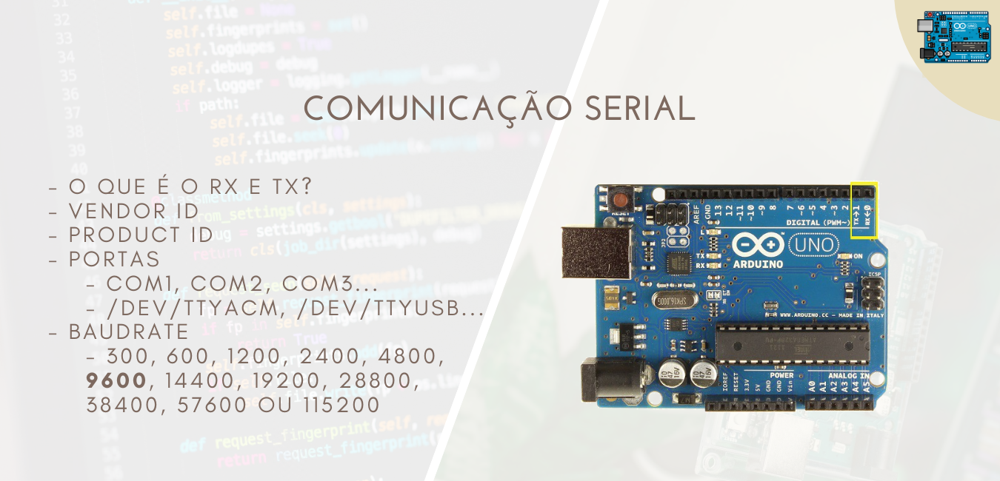

<p>
    A comunicação do Arduino com o Python se dá através da <b>Comunicação Serial</b>. A Comunicação Serial nada mais é do que a comunicação entre o Arduino e o computador em que ele está conectado, através do <b>Cabo USB</b>. Quando o computador envia informações para compilar um código no Arduino, quando você utiliza o <b>Monitor Serial</b>, entre outros, você está utilizando a interface Serial para realizar essas comunicações.
</p>

<p>
    Do ponto de vista do Hardware, os pinos por onde passam esses dados que podem ir do Arduino para o Computador ou do Computador para o Arduino, são os <b>RX</b> e <b>TX</b>. RX de 'Receber', é por onde passam todas as informações que recebe do Computador ou qualquer outro dispositivo em que esteja conectado. TX de 'Transmitir', é por onde passam todos os dados que o Arduino transmite para o dispositivo em que está conectado. Por isso <b>recomenda-se que não se utilize esses pinos</b> nos projetos, a não ser que sejam utilizados com propósitos específicos de transmissão e recepção de dados entre dispositivos. Porque quando eles são utilizados como portas comuns, a comunicação pode ser interrompida e <b>problemas com compilação de código</b> no Arduino entre outros podem ocorrer.
</p>

<p>
    Através da Comunicação Serial é possível descobrir informações como <b>Vendor ID</b> e <b>Product ID</b>, que são identificações únicas acerca do dispositivo em questão. Elas podem ser úteis para <b>identificar o Arduino</b> dentre outros dispositivos que possam estar conectados, além de ser útil para funcionalidades como autenticação de dispositivos e afins.
</p>

<p>
    Em relação a como os Arduinos e afins são identificados nos computadores, varia com o <b>Sistema Operacional</b>. No Windows, como pode ser visto na IDE do Arduino quando o código vai ser compilado, são identificados como portas <b>COM1, COM2, COM3...</b>, variando de acordo com a <b>porta USB</b> em que está conectado. Já no Linux, são identificados como <b>/dev/ttyacm, /dev/ttyusb, ...</b>, também a depender da porta em que foi conectado. <b>Saber como são identificados é importante</b> para realizar a conexão no Python, pois ele será utilizado no código para conseguir enviar mensagens e receber sempre da porta correta.
</p>

<p>
    Um último detalhe necessário para entender a comunicação serial seria o <b>Baudrate</b>. A seguir veremos como o Baudrate é programado, mas é importante saber que o valor de Baud determinado no Arduino deve ser exatamente igual ao indicado na linguagem de programação. Isso se deve ao fato desse valor determinar a velocidade em que as duas partes irão transferir bits de uma para a outra. Com o mesmo valor, elas conseguem sincronizar esses dados e tanto transmitir como receber da maneira correta. Esse valor está diretamente relacionado a <b>quantidade de bits por segundo</b> em que a comunicação ocorre. 
</p>

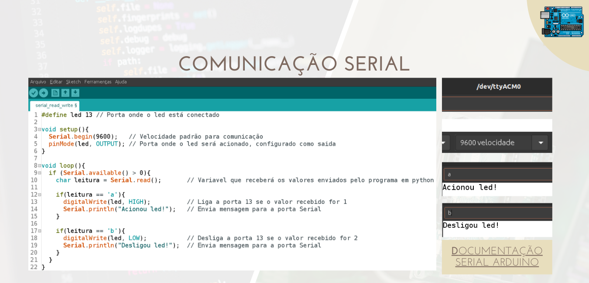

<p>
    Nesse código de exemplo podemos ver que o <code>Serial.begin(9600)</code> indica a inicialização da comunicação Serial por parte do Arduino. Nela também é possível notar o valor 9600, que indica a velocidade da comunicação. Depois, no loop(), é possível notar que o Arduino fica esperando receber alguma mensagem externa. Quando a mensagem externa é <code>a</code>, ele aciona o led e envia uma mensagem pela Serial dizendo <code>Acionou led!</code>. Se a mensagem externa for <code>b</code>, desliga o led e envia pela porta Serial a mensagem <code>Desligou led!</code>. 
</p>

<p>
    Essa mensagem externa que foi mencionada é a mensagem que virá do código em Python, que iremos explorar mais na frente. Nota-se que o Arduino utiliza a função <code>Serial.available()</code> para verificar se há uma mensagem externa, <code>Serial.read()</code> para receber e armazenar essa mensagem externa, depois que foi identificada, e por fim, <code>Serial.println()</code> para enviar uma mensagem de volta, para que o código em Python receba e tenha um feedback de que tudo ocorreu certo. Essa prática é bastante comum, verificar, receber, enviar feedback. Para todo sistema complexo, é necessário que sempre exista uma forma de verificar se tudo está acontecendo normalmente, para que, caso algum problema ocorra, isso possa ser solucionado.
</p>

<p>
    No lado direito é possível ver um teste, utilizando o <b>Monitor Serial</b> da própria IDE do Arduino. Nele é possível testar, enviando e recebendo as mensagens, representando o que seria o código em Python. <b>Este mesmo código será utilizado para alguns exemplos que serão expostos mais na frente.</b>
</p>

<b>
<a href='https://www.arduino.cc/reference/pt/language/functions/communication/serial/'> Link para a documentação do Serial Arduino</a>
</b>
<br/>
<br/>

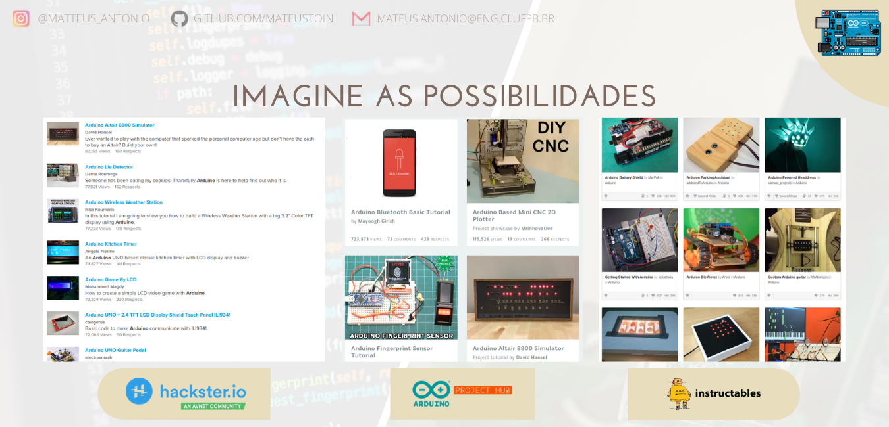

<p>
    Algumas dicas para aplicar o que já foi mencionado anteriormente, <b>em relação aos contests de projetos</b>. Essas são algumas plataformas que realizam essas atividades durante todo o ano, com desafios como "Faça um projeto que encaixe no bolso de uma calça" ou "Faça um projeto que utilize material reciclado", entre muitos outros. Esses desafios, unidos com a criatividade de cada um, unindo todas as ferramentas possíveis, podem gerar bons resultados e premiações legais. Além disso, essas <b>Plataformas</b> possuem milhares de projetos e ideias para alimentar a sua própria criatividade. 
</p>

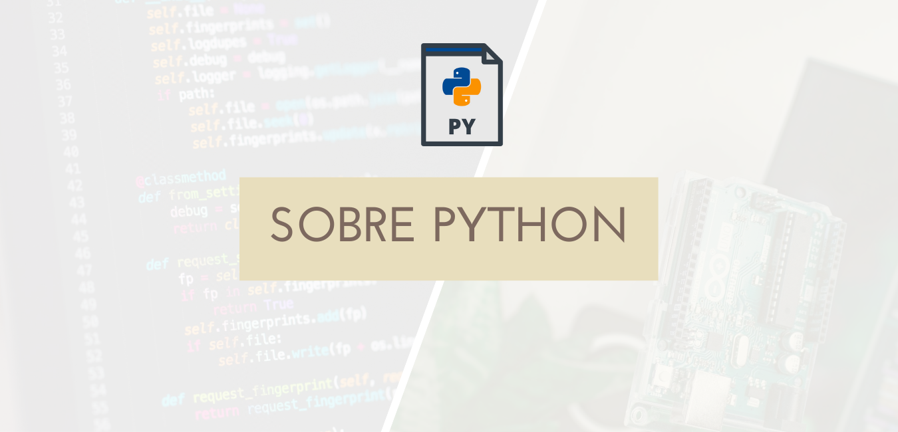

<p>
    Como o Arduino, o <b>Python</b> também possui sua própria forma de se comunicar pela interface Serial. Todos os exemplos foram testados utilizando <b>versões do Python superiores a 3.7+</b>. A biblioteca é importada com o comando <code>import serial</code>, como pode ser visto a seguir.
</p>

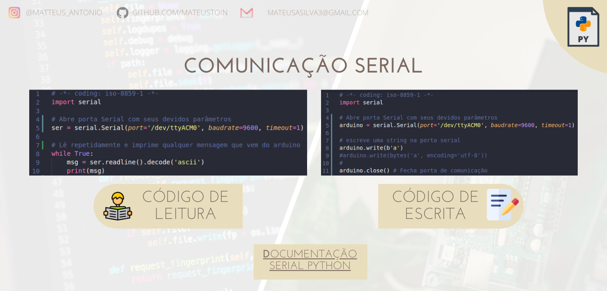

<p>
    Nos dois exemplos mostrados acima podem ser visto as duas formas de se comunicar, tanto <b>realizando leituras</b> quanto <b>realizando escritas</b> na <b>Interface Serial</b>. Nesse caso, com o código de Arduino mostrado acima, é possível testar todas as funcionalidades e transmitir mensagem, realizando a comunicação entre o Python e o Arduino.
</p>

<b>
<a href='https://pythonhosted.org/pyserial/index.html'> Link para a documentação do Serial Python</a>
</b>
<br/>
<br/>

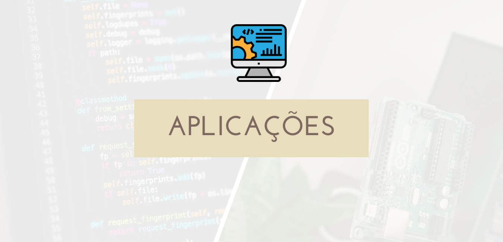

## Imagem: Aplicação Arduino + Python

`pip install pyserial`

```python
import serial

arduino = serial.Serial(port='/dev/ttyACM0', baudrate=9600, timeout=1)

while True:
    msg = input('Envie um comando: ')

    arduino.write(bytes(msg, encoding='utf-8'))

    retorno = arduino.readline().decode('ascii')
    print('Retorno: ' + retorno)
```

## Imagem: Speech to Text : Comandos por voz

```python
import speech_recognition as sr

#Funcao responsavel por ouvir e reconhecer a fala
def ouvir_microfone():
    #Habilita o microfone para ouvir o usuario
    microfone = sr.Recognizer()
    with sr.Microphone() as source:
        #Chama a funcao de reducao de ruido disponivel na speech_recognition
        microfone.adjust_for_ambient_noise(source, duration=1)
        #Avisa ao usuario que esta pronto para ouvir
        print("Diga alguma coisa: ")
        #Armazena a informacao de audio na variavel
        audio = microfone.listen(source, timeout=2, phrase_time_limit=4)
    try:
        #Passa o audio para o reconhecedor de padroes do speech_recognition
        frase = microfone.recognize_google(audio,language='pt-BR')
        
        #Caso nao tenha reconhecido o padrao de fala, exibe esta mensagem
    except sr.UnknownValueError:
        print("Não entendi")

    return frase

frase = ouvir_microfone()
print('Resposta: ' + frase)
```

## Imagem: Aplicação com OpenCV : Tirando fotos

`pip install opencv-python`

```python
import cv2                    # Importa biblioteca do opencv

cap = cv2.VideoCapture(1)     # Identifica a câmera do dispositivo 
ret,frame = cap.read()        # Retorna um único frame capturado da câmera

cv2.imwrite('test.png',frame) # Salva o frame capturado no arquivo test.png
```

## Imagem: Acionando sons

`pip install pygame`

```python
import pygame
import time

file = 'aimless-old habits.mp3'
pygame.init()
pygame.mixer.init()
pygame.mixer.music.load(file)
pygame.mixer.music.play()

time.sleep(10)

pygame.mixer.music.stop()
```

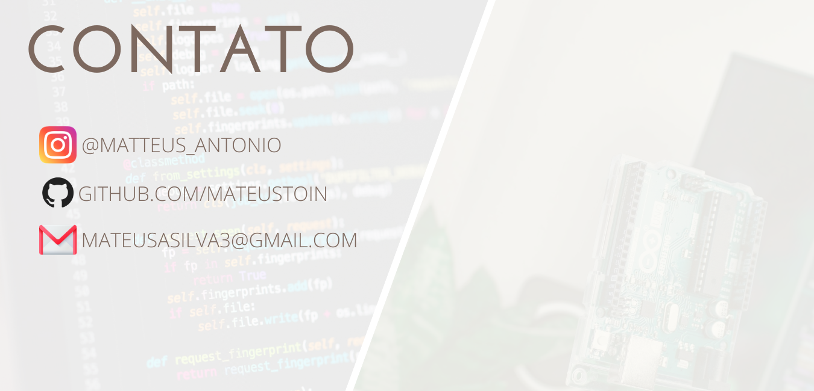