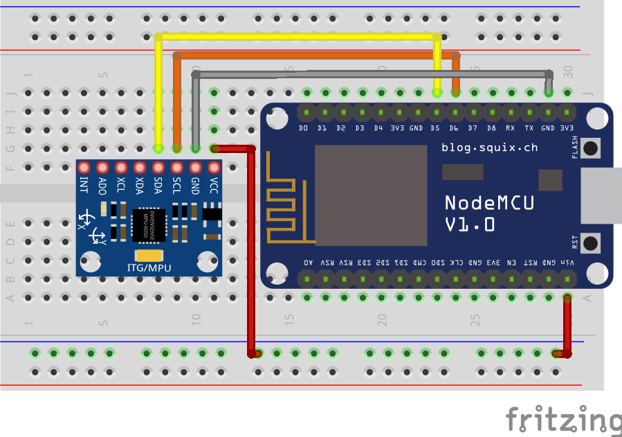
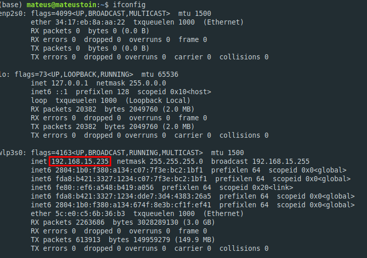

# Servidor local para coleta de dados do drone

> Versão de Python utilizada: Python 3.7.4

> Versão da IDE Arduino utilizada: Arduino 1.8.12

> Placa utilizada: Mini Wemos D1

> Sensor utilizado: MPU6050

## Instalação dos pacotes para execução do servidor

Para instalar os pacotes necessários para executar o servidor, basta utilizar o comando:

```
pip install -r requirements.txt
```

## Instalação dos pacotes para execução da ESP + Sensor

A primeira configuração a ser feita é na IDE do Arduino, para que o código do projeto possa ser compilado. Primeiro vá em **Arquivo > Preferências**, na janela terá um campo chamado **URLs Adicionais para Gerenciadores de Placas**. Nesse campo cole o link a seguir e clique em **OK**:

```http://arduino.esp8266.com/stable/package_esp8266com_index.json```

Depois disso vá em **Ferramentas > Placa:** e clique em **Gerenciador de Placas**. Pesquise por **esp8266** e aparecerá um pacote identificado por *esp8266 by ESP8266 Community*, instale-o. Após esses passos a IDE estará pronta para compilar o código na ESP8266.

## Configuração do Circuito

Com a IDE configurada, resta apenas configurar o circuito. Para qualquer placa de desenvolvimento (com ESP8266), deve-se conectar o SCL da placa no SCL da MPU, assim como o SDA da placa com o SDA da MPU. Deve ficar parecido com o circuito a seguir:



# Funcionamento da coleta com o servidor

Para que os dados possam ser enviados da ESP8266 para o servidor, primeiro é necessário saber o IP da máquina que o script em python estará executando. Utilize o comando no terminal:

```
Linux: ifconfig
Windows: ipconfig
```

Com ele será possível pegar o IP da máquina, como indicado na figura a seguir (Figura feita no ambiente Linux):



Com o *IP* da máquina em mãos, ela deve ser colocada na **linha 22** no código da ESP. Além disso, devem ser colocados também a *porta* (especificada no código do serviodr Flask) e a *rota* que os dados serão enviados, que nesse caso é **'/pibic'** como no exemplo:

~~~C
const char* link = "http://192.168.15.235:5000/pibic";
~~~

Com tudo configurado, a única restrição é que a placa e a máquina host do servidor estejam **conectados na mesma rede**.

Depois da coleta, quando o servidor for encerrado com o comando **'Ctrl + C'**, um arquivo *.csv* será salvo com todos os dados da coleta.