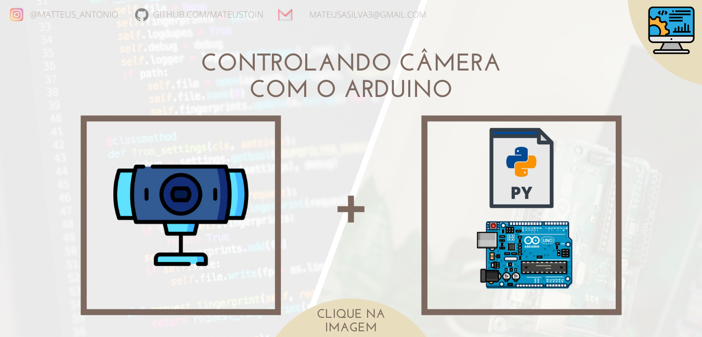

<p align="center">
<a href="https://github.com/mateustoin/Palestra-Python-para-Arduino/blob/master/codes/opencv/arduino-cam.md">
  
</a>
</p>

## Configuração

<p>
  Para o funcionamento dos códigos de comunicação serial no python, a instalação do pacote a seguir é necessária. Basta digitar no terminal com <i>python</i> e <i>pip</i> instalados:
</p>

`pip install opencv-python`

## Prática

```python
import cv2                    # Importa biblioteca do opencv

cap = cv2.VideoCapture(1)     # Identifica a câmera do dispositivo 
ret,frame = cap.read()        # Retorna um único frame capturado da câmera

cv2.imwrite('test.png',frame) # Salva o frame capturado no arquivo test.png
```