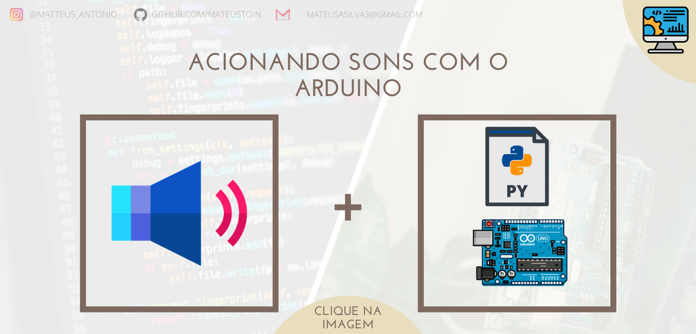

<p align="center">
<a href="https://github.com/mateustoin/Palestra-Python-para-Arduino/blob/master/codes/pysound/arduino-som.md">
  
</a>
</p>

## Configuração

<p>
  Para o funcionamento dos códigos de comunicação serial no python, a instalação do pacote a seguir é necessária. Basta digitar no terminal com <i>python</i> e <i>pip</i> instalados:
</p>

`pip install pygame`

## Prática

```python
import pygame
import time

file = 'aimless-old habits.mp3'
pygame.init()
pygame.mixer.init()
pygame.mixer.music.load(file)
pygame.mixer.music.play()

time.sleep(10)

pygame.mixer.music.stop()
```