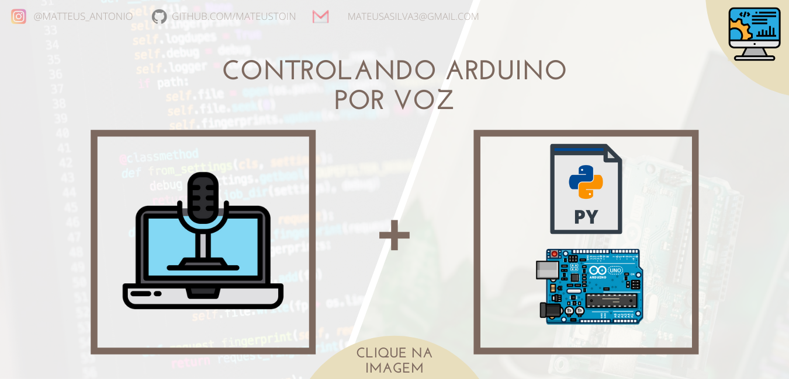

<p align="center">
<a href="https://github.com/mateustoin/Palestra-Python-para-Arduino/blob/master/codes/speech-to-text/arduino-voz.md">
  
</a>
</p>

## Configuração

<p>
  Para o funcionamento dos códigos de comunicação serial no python, a instalação do pacote de <i>Speech Recognition</i> é necessária. Basta <a href="https://medium.com/@mateustoin/como-instalar-speech-recognition-no-python-89862f411f2e"> acessar este link</a> e seguir as instruções.
</p>

## Prática

```python
import speech_recognition as sr

#Funcao responsavel por ouvir e reconhecer a fala
def ouvir_microfone():
    #Habilita o microfone para ouvir o usuario
    microfone = sr.Recognizer()
    with sr.Microphone() as source:
        #Chama a funcao de reducao de ruido disponivel na speech_recognition
        microfone.adjust_for_ambient_noise(source, duration=1)
        #Avisa ao usuario que esta pronto para ouvir
        print("Diga alguma coisa: ")
        #Armazena a informacao de audio na variavel
        audio = microfone.listen(source, timeout=2, phrase_time_limit=4)
    try:
        #Passa o audio para o reconhecedor de padroes do speech_recognition
        frase = microfone.recognize_google(audio,language='pt-BR')
        
        #Caso nao tenha reconhecido o padrao de fala, exibe esta mensagem
    except sr.UnknownValueError:
        print("Não entendi")

    return frase

frase = ouvir_microfone()
print('Resposta: ' + frase)
```